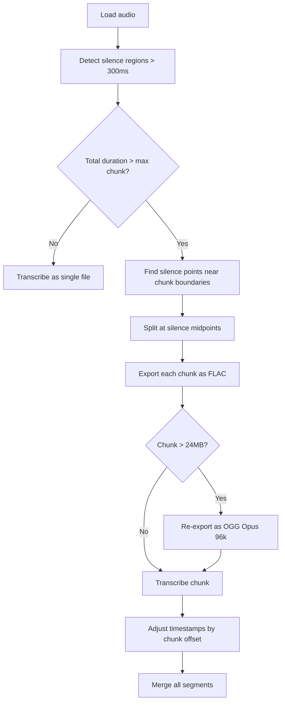

# Audio Chunking Improvement Plan for OpenAI Whisper

## Current Implementation Problems

In [`openai_whisper.py`](src/perceive8/providers/openai_whisper.py:154-159), large files are:
1. Split into 10-minute chunks with 1-second overlap
2. Exported as MP3 at 128k (falling back to 64k if still >24MB)
3. Concatenated with naive text joining — no deduplication of overlap regions

### Issues
- **Quality loss**: WAV→MP3 at 128k is lossy; Whisper accuracy degrades with compression artifacts
- **Naive overlap**: 1 second of overlap doesn't guarantee word boundaries; overlapping segments are not deduplicated, causing duplicate text
- **No silence-aware splitting**: Chunks may cut mid-word or mid-sentence

---

## Recommendations

### 1. Export Format: Use FLAC or OGG/Opus Instead of MP3

OpenAI Whisper accepts: `flac`, `mp3`, `mp4`, `mpeg`, `mpga`, `m4a`, `ogg`, `wav`, `webm`.

| Format | Type | Quality | Size vs WAV |
|--------|------|---------|-------------|
| FLAC | Lossless | Perfect | ~50-60% of WAV |
| OGG/Opus | Lossy | Near-transparent at 64k+ | ~5-10% of WAV |
| MP3 128k | Lossy | Noticeable artifacts | ~10% of WAV |

**Recommendation**: Use **FLAC** as the primary chunk format. It's lossless and typically compresses speech WAV by 50-60%, easily fitting 10-minute chunks under 25MB. If a FLAC chunk exceeds 24MB (unlikely for speech), fall back to **OGG/Opus at 96k** which is near-transparent quality and much smaller.

### 2. Smart Splitting: Silence Detection with pydub

Instead of splitting at fixed intervals, detect silence gaps and split there:

```
Strategy: Silence-based splitting
```

- Use `pydub.silence.detect_silence()` or `split_on_silence()` to find natural pauses
- Target ~10 minute chunks but allow flexibility (8-12 min) to land on silence boundaries
- Algorithm:
  1. Detect all silence regions (e.g., >300ms below -40dBFS)
  2. Walk through silence points, accumulating duration
  3. When accumulated duration approaches `MAX_CHUNK_DURATION_MS`, split at the nearest silence point
  4. If no silence found within a reasonable window, fall back to fixed split with overlap

This eliminates the need for overlap entirely since splits happen at natural pauses.



### 3. Why NOT Other Approaches

#### VAD - Voice Activity Detection
- Overkill for this use case. Silence detection achieves the same goal with pydub (already a dependency) without adding `webrtcvad` or `silero-vad` as dependencies.
- VAD is useful when you need to strip non-speech entirely, but here we just need good split points.

#### OpenAI Streaming API
- OpenAI does **not** offer a streaming transcription API for Whisper. The only option is the batch file upload endpoint with a 25MB limit. No chunked/streaming alternative exists.

#### Overlap + Deduplication
- Complex to implement correctly (fuzzy text matching across chunk boundaries)
- Silence-based splitting makes this unnecessary — if you split at silence, there's nothing to deduplicate

### 4. Handling the Overlap Region (if silence detection fails)

For the fallback case where no silence is found, keep a small overlap but **deduplicate using word timestamps**:

- Overlap region: last N seconds of chunk A and first N seconds of chunk B both get transcribed
- Compare word timestamps in the overlap window
- Drop words from chunk B whose timestamps fall within chunk A's range
- This is straightforward since we already have word-level timestamps from `timestamp_granularities=["word"]`

---

## Implementation Steps

1. **Replace MP3 export with FLAC** in [`_transcribe_single_file`](src/perceive8/providers/openai_whisper.py:158-159) chunk export logic, with OGG/Opus fallback
2. **Add silence detection function** that returns optimal split points using `pydub.silence.detect_silence()`
3. **Refactor chunk boundary calculation** to use silence-based split points instead of fixed intervals
4. **Add word-timestamp deduplication** for the fallback fixed-split case
5. **Remove naive text concatenation** — merge `all_texts` properly, accounting for potential overlap
6. **Add tests** for silence-based splitting and the FLAC export path
