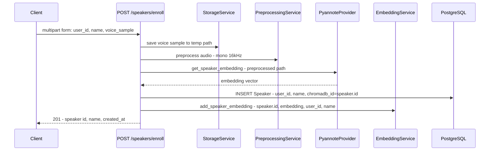
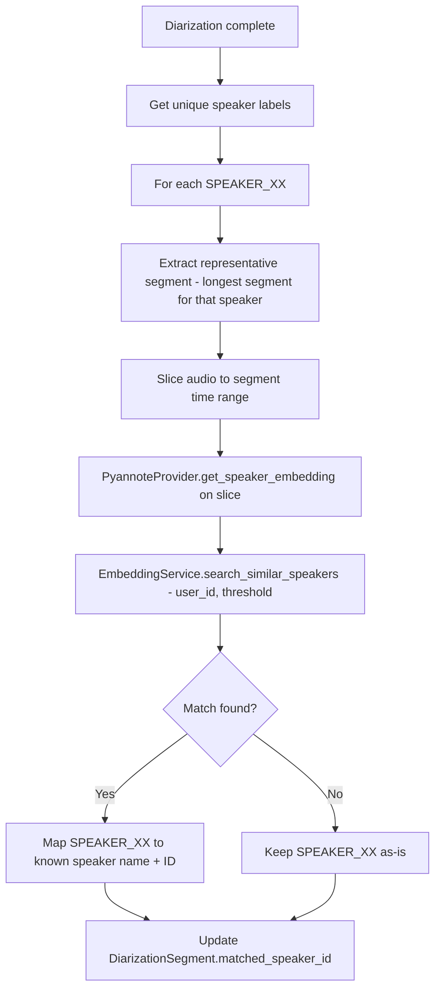

# ChromaDB Integration & Speaker Enrollment Architecture

## 1. `services/embedding.py` — EmbeddingService

### Class Design

```python
class EmbeddingService:
    def __init__(self, settings: Settings)
```

**Initialization logic:** Use `chromadb.PersistentClient(path=settings.chromadb_path)` for local persistent storage. No HTTP client config exists in [`Settings`](src/perceive8/config.py:26) currently — only `chromadb_path` is defined. If remote ChromaDB is needed later, add `CHROMADB_HOST`/`CHROMADB_PORT` to config and switch to `chromadb.HttpClient`.

### Collection: `speaker_embeddings`

| Field | Type | Purpose |
|-------|------|---------|
| **id** | string | `str(speaker.id)` — matches PostgreSQL Speaker UUID |
| **embedding** | float vector | Pyannote embedding from [`get_speaker_embedding`](src/perceive8/providers/pyannote.py:140) |
| **metadata.user_id** | string | Owner user ID for scoped queries |
| **metadata.speaker_name** | string | Human-readable name |
| **metadata.created_at** | string | ISO timestamp |

- **Distance metric:** `cosine` — standard for speaker verification embeddings
- Collection created via `client.get_or_create_collection("speaker_embeddings", metadata={"hnsw:space": "cosine"})`

### Collection: `transcript_embeddings` (future RAG)

| Field | Type | Purpose |
|-------|------|---------|
| **id** | string | `str(transcript_segment.id)` |
| **embedding** | float vector | OpenAI text embedding of segment text |
| **document** | string | The transcript text itself |
| **metadata.analysis_id** | string | Parent analysis |
| **metadata.user_id** | string | Owner |
| **metadata.speaker_name** | string | Resolved speaker name |
| **metadata.start_time** | float | Segment start |
| **metadata.end_time** | float | Segment end |

- **Distance metric:** `cosine`

### Methods

```python
async def add_speaker_embedding(
    self, speaker_id: str, embedding: list[float],
    user_id: str, speaker_name: str
) -> None

async def search_similar_speakers(
    self, embedding: list[float], user_id: str,
    threshold: float = 0.7, n_results: int = 5
) -> list[dict]  # returns [{speaker_id, distance, speaker_name}, ...]

async def delete_speaker_embedding(self, speaker_id: str) -> None

async def add_transcript_embedding(
    self, segment_id: str, embedding: list[float],
    text: str, metadata: dict
) -> None

async def search_transcripts(
    self, query_embedding: list[float], user_id: str,
    n_results: int = 10
) -> list[dict]
```

> **Note:** ChromaDB operations are synchronous. Wrap in `asyncio.to_thread()` if needed, or call directly since they are fast for small collections.

The `search_similar_speakers` method must filter by `user_id` using ChromaDB `where` clause so users only match against their own enrolled speakers. The `threshold` is applied post-query by filtering results where `distance < threshold` (cosine distance; lower = more similar).

---

## 2. Speaker Enrollment Flow — `POST /speakers/enroll`



### Implementation in [`routes/speakers.py`](src/perceive8/routes/speakers.py:11)

The [`enroll_speaker`](src/perceive8/routes/speakers.py:12) endpoint should:

1. Save uploaded `voice_sample` to a temp file
2. Run [`preprocess_audio`](src/perceive8/services/preprocessing.py) to normalize to mono 16kHz WAV
3. Call [`PyannoteProvider.get_speaker_embedding`](src/perceive8/providers/pyannote.py:140) on preprocessed file
4. Create [`Speaker`](src/perceive8/models/database.py:28) record in PostgreSQL with `chromadb_id = str(speaker.id)`
5. Call `EmbeddingService.add_speaker_embedding()` with the speaker UUID and embedding
6. Clean up temp files
7. Return speaker info

**Error handling:** If ChromaDB write fails after PG insert, delete the PG record (compensating transaction). Alternatively, write PG last so ChromaDB failure prevents PG write.

**Recommended order:** ChromaDB first, then PG. If PG fails, delete from ChromaDB. This way the source of truth (PG) is only written on full success.

---

## 3. Speaker Matching in Pipeline

### Where it fits in [`run_analysis_pipeline`](src/perceive8/services/pipeline.py:97)

Insert a new **step 7.5** between diarization merge (step 7) and return — or better, between diarization (step 5) and merge (step 7):

```
Steps: store → preprocess → quality → enhance → diarize → **match speakers** → transcribe → merge
```

### Matching Logic



### Key design decisions

- **Representative segment selection:** For each unique `speaker_label`, pick the longest diarization segment (most audio = best embedding quality). Alternatively, concatenate multiple segments.
- **Audio slicing:** Use pydub or scipy to extract the time range from the preprocessed audio file.
- **Threshold:** Default `0.7` cosine similarity (i.e., `0.3` cosine distance). Make configurable via `Settings`.
- **Speaker map:** Build a `dict[str, Optional[Speaker]]` mapping `SPEAKER_00 -> Speaker` that gets passed into merge step.
- **Update [`MergedSegment`](src/perceive8/services/pipeline.py:27):** Add optional `matched_speaker_id: Optional[str]` and `matched_speaker_name: Optional[str]` fields.
- **Update [`DiarizationSegment`](src/perceive8/models/database.py:110):** The [`matched_speaker_id`](src/perceive8/models/database.py:116) column already exists — populate it during persistence.

### New helper function

```python
async def match_speakers_in_pipeline(
    audio_path: str,
    diarization_result: DiarizationResult,
    user_id: str,
    embedding_service: EmbeddingService,
    pyannote_provider: PyannoteProvider,
    threshold: float = 0.7,
) -> dict[str, Speaker | None]
```

This can live in `services/embedding.py` or a new `services/speaker_matching.py`.

---

## 4. Lifespan Initialization — [`main.py`](src/perceive8/main.py:12)

```python
@asynccontextmanager
async def lifespan(app: FastAPI):
    settings = get_settings()

    # Initialize ChromaDB
    embedding_service = EmbeddingService(settings)
    app.state.embedding_service = embedding_service

    # Initialize DB pool (existing TODO)
    # ...

    yield

    # Shutdown — no cleanup needed for PersistentClient
```

Access in routes via `request.app.state.embedding_service`.

---

## 5. Dependencies

- `chromadb>=0.4.22` — already in [`pyproject.toml`](pyproject.toml:21) ✅
- No new packages required
- `pydub` already available for audio slicing (segment extraction)

---

## 6. Config Changes

Add to [`Settings`](src/perceive8/config.py:26):

```python
speaker_match_threshold: float = Field(default=0.7)
```

The existing [`chromadb_path`](src/perceive8/config.py:33) is sufficient for persistent local storage.

---

## Implementation TODO

1. Create `services/embedding.py` with `EmbeddingService` class — init, collections, all 5 methods
2. Add `speaker_match_threshold` to `Settings` in `config.py`
3. Initialize `EmbeddingService` in `main.py` lifespan, store on `app.state`
4. Implement `POST /speakers/enroll` in `routes/speakers.py` — full enrollment flow
5. Implement `GET /speakers` — query PostgreSQL with pagination
6. Implement `GET /speakers/{id}` — fetch single speaker
7. Implement `DELETE /speakers/{id}` — delete from both PG and ChromaDB
8. Create speaker matching helper — audio slicing + embedding extraction + ChromaDB search
9. Integrate speaker matching into `run_analysis_pipeline` after diarization step
10. Add `matched_speaker_id` and `matched_speaker_name` fields to `MergedSegment`
11. Write tests for `EmbeddingService` — mock ChromaDB client
12. Write tests for speaker enrollment endpoint
13. Write tests for speaker matching logic
