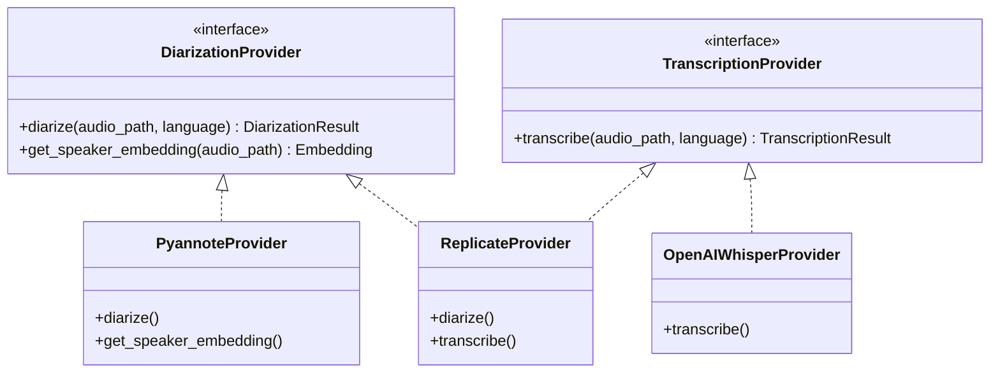
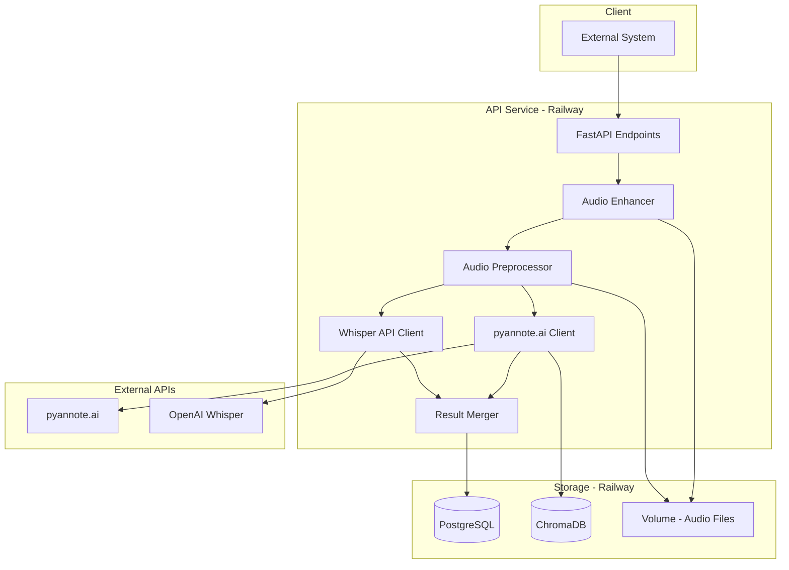
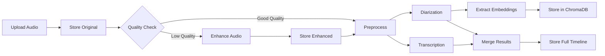

# Conversation Analyzer - Project Plan

## Overview
A REST API service for analyzing audio recordings of conversations between two people, with speaker identification and transcription. Deployed on Railway.

## Technology Stack
- **Framework:** FastAPI
- **Diarization & Speaker ID:** Pluggable providers (pyannote.ai, Replicate, etc.)
- **Transcription:** Pluggable providers (OpenAI Whisper, Replicate, etc.)
- **Language:** Python 3.10+
- **Supported Languages:** English, Hebrew, Spanish
- **Database:** PostgreSQL (Railway managed) - relational data
- **Vector Database:** ChromaDB - speaker/transcript embeddings
- **File Storage:** Railway Volume - audio files
- **Audio Enhancement:** noisereduce / deepfilternet
- **Deployment:** Railway

## Provider Abstraction

The system uses a pluggable provider architecture for easy model swapping and benchmarking:



### Supported Providers
- **Diarization:** pyannote.ai, Replicate (pyannote, whisperx models)
- **Transcription:** OpenAI Whisper, Replicate (whisper models)
- **Configuration:** Set via environment or per-request

## Stage 2 Considerations
This architecture stores all raw and processed data for future analytics:
- Original and enhanced audio files
- Full transcripts with word-level timestamps
- Speaker embeddings for pattern matching
- Conversation metadata and timelines

## Architecture



## Data Flow Pipeline



## API Endpoints

### Analysis Endpoints
- `POST /analyze` - Submit audio for analysis
  - Input: user_id, audio_file, language (en/he/es), diarization_provider, transcription_provider
- `GET /analysis/{id}` - Get analysis result by ID
- `GET /analysis` - List analyses (filter by user_id)

### Benchmarking Endpoints
- `POST /benchmark` - Run same audio through multiple providers
  - Input: user_id, audio_file, language, providers list
  - Output: Results from each provider with timing and quality metrics
- `GET /benchmark/{id}` - Get benchmark results

### Speaker Management
- `POST /speakers` - Enroll new speaker with voice sample
- `GET /speakers` - List speakers (filter by user_id)
- `DELETE /speakers/{id}` - Remove speaker

### Health
- `GET /health` - Service health check

### Q&A - RAG over Transcripts
- `POST /query` - Ask questions about transcripts
  - Input: user_id, question, optional analysis_ids filter
  - Process: embed question → search ChromaDB → retrieve relevant segments → LLM generates answer
  - Output: answer with source segments and timestamps

## Database Schema

### PostgreSQL - Relational Data

```mermaid
erDiagram
    users {
        uuid id PK
        string external_id
        timestamp created_at
    }
    
    speakers {
        uuid id PK
        uuid user_id FK
        string name
        string chromadb_id
        timestamp created_at
    }
    
    audio_files {
        uuid id PK
        uuid analysis_id FK
        string original_path
        string enhanced_path
        float duration_seconds
        int sample_rate
        boolean was_enhanced
        timestamp created_at
    }
    
    analyses {
        uuid id PK
        uuid user_id FK
        uuid audio_file_id FK
        string language
        timestamp created_at
    }
    
    processing_runs {
        uuid id PK
        uuid analysis_id FK
        string run_type (diarization or transcription)
        string provider_name
        string model_name
        string status
        float processing_time_seconds
        json raw_response
        timestamp started_at
        timestamp completed_at
    }
    
    transcript_segments {
        uuid id PK
        uuid processing_run_id FK
        uuid speaker_id FK
        float start_time
        float end_time
        string text
        float confidence
        json word_timestamps
    }
    
    diarization_segments {
        uuid id PK
        uuid processing_run_id FK
        string speaker_label
        uuid matched_speaker_id FK
        float start_time
        float end_time
        float confidence
    }
    
    analyses ||--o{ processing_runs : has
    processing_runs ||--o{ transcript_segments : produces
    processing_runs ||--o{ diarization_segments : produces
    
    users ||--o{ speakers : has
    users ||--o{ analyses : has
    analyses ||--|| audio_files : has
    analyses ||--o{ transcript_segments : contains
    transcript_segments }o--|| speakers : spoken_by
```

### ChromaDB - Vector Storage

Collections:
- **speaker_embeddings** - Voice embeddings per speaker for identification
  - Metadata: user_id, speaker_id, speaker_name
- **transcript_embeddings** - Text embeddings for semantic search / Q&A
  - Metadata: user_id, analysis_id, speaker_id, start_time, end_time

## Core Components

### 1. FastAPI Application
- REST endpoints for analysis and speaker management
- Request validation with Pydantic
- Async/background processing for long audio files

### 2. Audio Enhancement Module
- Quality detection (SNR analysis)
- Noise reduction using noisereduce library
- Optional deep learning enhancement with DeepFilterNet
- Store both original and enhanced versions

### 3. Audio Preprocessor
- Convert MP3 to WAV
- Normalize audio levels
- Resample to consistent rate
- Store metadata (duration, sample rate)

### 4. File Storage Service
- Save to Railway Volume
- Organize by user_id/analysis_id
- Track file paths in PostgreSQL

### 5. Speaker Enrollment Service
- Register known speakers with voice samples
- Extract embeddings via pyannote.ai
- Store embeddings in ChromaDB with metadata
- Vector similarity search for identification

### 6. Diarization Client - pyannote.ai
- Send audio for processing
- Receive speaker segments with timestamps
- Match segments to enrolled speakers via ChromaDB

### 7. Transcription Client - OpenAI Whisper
- Send audio for transcription
- Request word-level timestamps
- Store full response for future analysis

### 8. Result Merger
- Align transcription with speaker segments
- Store granular timeline data (transcript_segments table)
- Generate unified transcript with speaker labels

### 9. Transcript Embedding Service
- Embed transcript segments using OpenAI text-embedding-ada-002
- Store in ChromaDB transcript_embeddings collection
- Include metadata: user_id, analysis_id, speaker, timestamps

### 10. RAG Query Service
- Embed user question
- Semantic search in ChromaDB for relevant transcript segments
- Build context from retrieved segments
- Send to OpenAI GPT for answer generation
- Return answer with source citations (speaker, timestamp, text)

## Project Structure

```
conversation-analyzer/
├── src/
│   └── conversation_analyzer/
│       ├── __init__.py
│       ├── config.py           # Settings from environment
│       ├── main.py             # FastAPI app entry point
│       ├── routes/
│       │   ├── analysis.py
│       │   ├── speakers.py
│       │   ├── query.py
│       │   ├── benchmark.py
│       │   └── health.py
│       ├── models/
│       │   ├── database.py     # SQLAlchemy models
│       │   └── schemas.py      # Pydantic schemas
│       ├── providers/
│       │   ├── __init__.py
│       │   ├── base.py         # Provider interfaces
│       │   ├── pyannote.py     # pyannote.ai provider
│       │   ├── replicate.py    # Replicate provider
│       │   ├── openai_whisper.py
│       │   └── factory.py      # Provider factory
│       ├── services/
│       │   ├── preprocessing.py
│       │   ├── enhancement.py
│       │   ├── storage.py
│       │   ├── embedding.py
│       │   ├── rag.py
│       │   └── pipeline.py
│       └── db.py               # Database connection
├── tests/
├── alembic/                    # DB migrations
├── services/                   # Railway service configs
│   ├── README.md               # Setup instructions
│   └── railway.json            # Railway project config
├── .env.example                # Environment template
├── Dockerfile
├── pyproject.toml
└── README.md
```

## Local Development with Railway Services

### Setup
1. Install Railway CLI: `npm i -g @railway/cli`
2. Login: `railway login`
3. Link to project: `railway link`

### Development Workflow
```bash
# Copy env template
cp .env.example .env

# Get Railway service URLs (PostgreSQL, ChromaDB Volume path)
railway variables

# Use Railway DB remotely while running app locally
export DATABASE_URL=$(railway variables get DATABASE_URL)

# Run app locally
uvicorn src.conversation_analyzer.main:app --reload
```

### services/README.md content:
- Instructions to create Railway project
- PostgreSQL plugin setup
- Volume setup for audio files
- ChromaDB persistent storage config
- Environment variable mapping

## Todo List

1. Create project structure with pyproject.toml and FastAPI setup
2. Set up SQLAlchemy models and Alembic migrations for PostgreSQL
3. Configure ChromaDB for speaker embeddings storage
4. Set up Railway Volume for audio file storage
5. Configure settings module for API keys, DB, and storage paths
6. Implement audio enhancement module (noisereduce, quality detection)
7. Implement audio preprocessing module (format conversion, normalization)
8. Implement file storage service (save/retrieve from Volume)
9. Implement pyannote.ai client for diarization
10. Implement speaker enrollment with embedding extraction to ChromaDB
11. Implement OpenAI Whisper client for transcription with word timestamps
12. Build analysis pipeline with full timeline data storage
13. Implement speaker management endpoints (POST/GET/DELETE /speakers)
14. Implement analysis endpoints (POST/GET /analysis)
15. Add Dockerfile for Railway deployment
16. Write README with API documentation

## Environment Variables

```
DATABASE_URL=postgresql://...
CHROMADB_PATH=/data/chromadb
AUDIO_STORAGE_PATH=/data/audio
PYANNOTE_API_KEY=...
OPENAI_API_KEY=...
```

## Data Stored for Stage 2 Analytics

- Original audio files (preserved)
- Enhanced audio files (when applicable)
- Audio metadata (duration, sample rate, enhancement applied)
- Speaker embeddings (vector similarity queries)
- Full transcripts with word-level timestamps
- Speaker segments with time ranges
- Confidence scores per segment
- Processing timestamps and durations
