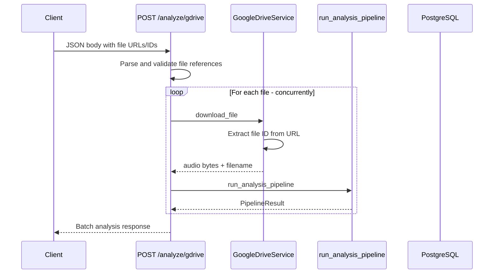

# Google Drive Integration for Perceive8

## 1. Architecture Overview



### Auth Approach: API Key for Public/Shared Files

Use the **Google Drive API v3 with an API key** for the initial implementation. This is the simplest server-side approach and works for files shared as "Anyone with the link." 

- No OAuth flow needed
- No service account JSON key file to manage
- Single env var: `GOOGLE_API_KEY`
- Limitation: only works for publicly shared / link-shared files

If private file access is needed later, upgrade to a service account approach.

### Endpoint Strategy: New Dedicated Endpoint

Add `POST /analyze/gdrive` rather than extending the existing form-based endpoint. Reasons:
- The existing endpoint uses `Form` + `UploadFile` — mixing with JSON body is awkward
- Clean separation of concerns
- The gdrive endpoint accepts JSON, the existing one accepts multipart form data

### Batch Processing: Concurrent with Semaphore

Use `asyncio.gather` with a semaphore to limit concurrency (e.g., max 3 concurrent downloads/analyses). This prevents overwhelming external APIs while still being faster than sequential.

## 2. New Files to Create

| File | Purpose |
|------|---------|
| [`src/perceive8/services/gdrive.py`](src/perceive8/services/gdrive.py) | Google Drive download service |
| [`src/perceive8/routes/gdrive.py`](src/perceive8/routes/gdrive.py) | `/analyze/gdrive` endpoint |
| [`tests/test_gdrive.py`](tests/test_gdrive.py) | Unit tests for gdrive service and route |

## 3. Config Additions

Add to [`Settings`](src/perceive8/config.py:26) in [`config.py`](src/perceive8/config.py):

```python
# Google Drive
google_api_key: str = Field(default="")
gdrive_max_file_size_mb: int = Field(default=500)
gdrive_max_concurrent: int = Field(default=3)
```

Add to [`.env.example`](.env.example):
```
GOOGLE_API_KEY=
GDRIVE_MAX_FILE_SIZE_MB=500
GDRIVE_MAX_CONCURRENT=3
```

## 4. API Endpoint Design

### Request Schema

```python
class GDriveFileRef(BaseModel):
    """A single Google Drive file reference."""
    url_or_id: str  # Full URL or raw file ID

class GDriveAnalyzeRequest(BaseModel):
    """Request to analyze audio files from Google Drive."""
    user_id: str
    files: List[GDriveFileRef]  # 1..20 files
    language: Optional[str] = None
    diarization_provider: Optional[str] = None
    transcription_providers: Optional[List[str]] = None
```

### Response Schema

```python
class GDriveFileResult(BaseModel):
    """Result for a single file in the batch."""
    file_id: str
    filename: str
    status: str  # success | error
    analysis_id: Optional[str] = None
    error: Optional[str] = None

class GDriveAnalyzeResponse(BaseModel):
    """Batch analysis response."""
    total: int
    succeeded: int
    failed: int
    results: List[GDriveFileResult]
```

### Endpoint

```
POST /analyze/gdrive
Content-Type: application/json
```

## 5. Implementation Steps

### 5.1 Google Drive Service — [`gdrive.py`](src/perceive8/services/gdrive.py)

Core functions:

- **`extract_file_id(url_or_id: str) -> str`** — Parse Google Drive URLs to extract file ID. Support formats:
  - `https://drive.google.com/file/d/{id}/view`
  - `https://drive.google.com/open?id={id}`
  - Raw file ID string

- **`get_file_metadata(file_id: str, api_key: str) -> dict`** — Call `GET https://www.googleapis.com/drive/v3/files/{id}?fields=name,mimeType,size&key={api_key}` to validate the file exists and check mime type/size before downloading.

- **`download_file(file_id: str, api_key: str) -> tuple[bytes, str]`** — Call `GET https://www.googleapis.com/drive/v3/files/{id}?alt=media&key={api_key}` to download file content. Returns `(audio_bytes, filename)`.

- **`validate_audio_file(mime_type: str, size: int, max_size_mb: int) -> None`** — Raise `ValueError` if mime type is not audio/* or size exceeds limit.

Use `httpx.AsyncClient` for HTTP calls (already async-compatible with the codebase).

### 5.2 Route — [`gdrive.py`](src/perceive8/routes/gdrive.py)

- Parse request, validate file count (1-20)
- For each file, run download + pipeline concurrently via `asyncio.gather` with semaphore
- Each file gets its own Analysis + AudioFile DB records (same pattern as existing [`analyze`](src/perceive8/routes/analysis.py:74) endpoint)
- Collect results, return batch response
- Register router in [`main.py`](src/perceive8/main.py)

### 5.3 Tests

- Unit test `extract_file_id` with various URL formats
- Unit test `validate_audio_file` with valid/invalid mime types
- Mock `httpx` calls for download tests
- Integration test for the endpoint with mocked Google Drive API

## 6. Error Handling Strategy

| Error | HTTP Status | Behavior |
|-------|-------------|----------|
| Invalid URL/ID format | 422 | Reject in request validation |
| File not found / not shared | Per-file error in response | `status: error` with message |
| File is not audio | Per-file error | `status: error`, skip pipeline |
| File too large | Per-file error | `status: error`, skip download |
| Google API key missing | 500 | Raise on startup or first request |
| Download timeout | Per-file error | 60s timeout, `status: error` |
| Pipeline failure | Per-file error | Catch exception, `status: error` |
| All files failed | 200 | Return response with `succeeded: 0` — let client decide |

Key principle: **batch requests never fail entirely** due to individual file errors. Each file gets its own status in the response. The HTTP response is always 200 unless the request itself is malformed.
