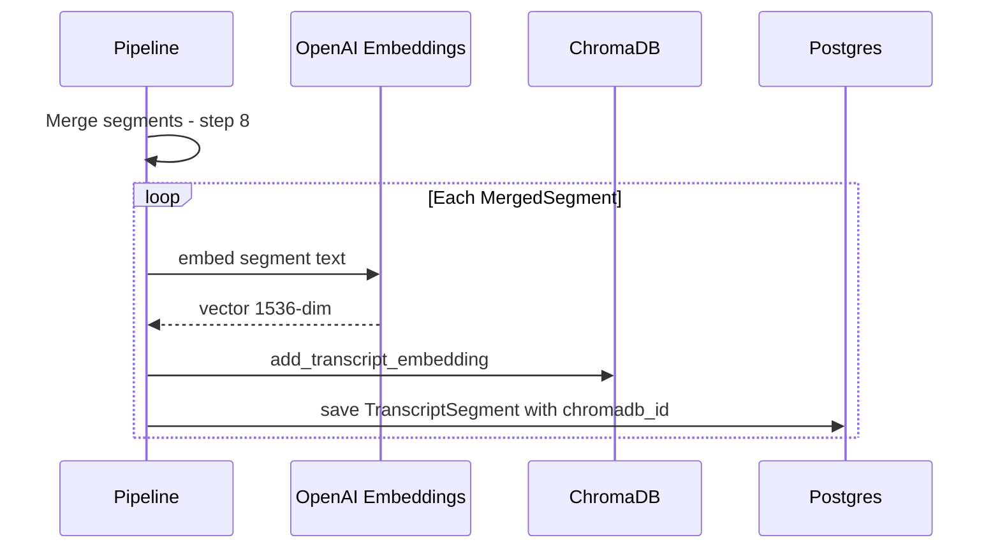
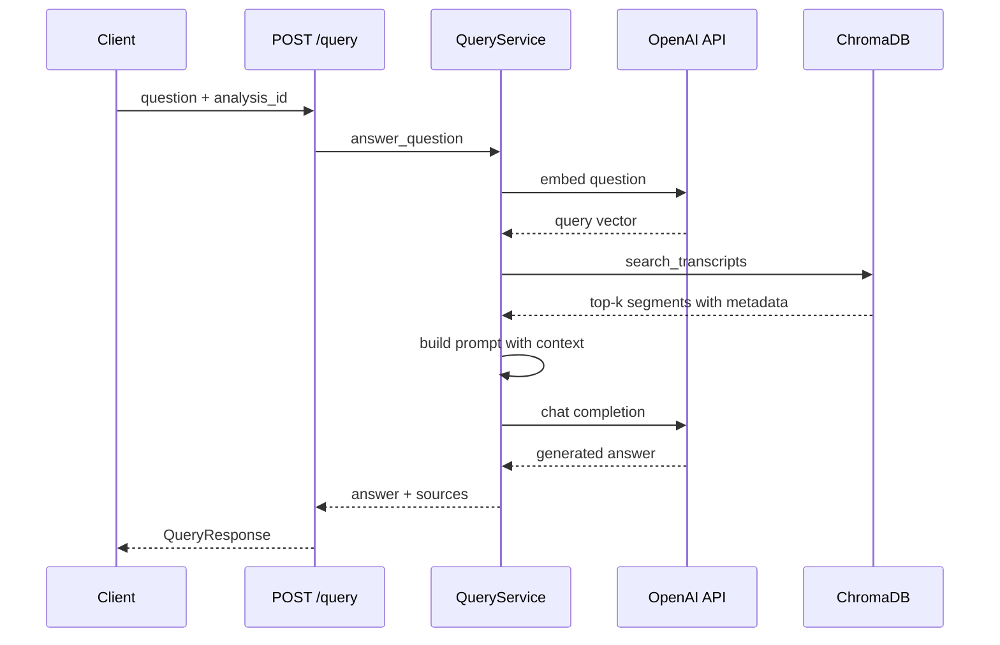

# RAG Query Service — Architecture Plan

## Overview

Add a Retrieval-Augmented Generation query service to Perceive8, allowing users to ask natural-language questions about their analyzed conversations and receive answers grounded in transcript segments.

---

## 1. Transcript Embedding Flow

### Embedding Model

| Model | Dimensions | Cost | Notes |
|---|---|---|---|
| `text-embedding-3-small` | 1536 (default) | $0.02/1M tokens | **Recommended** — good quality/cost ratio |
| `text-embedding-ada-002` | 1536 | $0.10/1M tokens | Legacy, no reason to prefer |

**Decision:** Use `text-embedding-3-small` with default 1536 dimensions. The existing ChromaDB [`transcript_embeddings`](src/perceive8/services/embedding.py:39) collection uses cosine distance, which is compatible.

### When to Embed

Add a post-pipeline embedding step in [`run_analysis_pipeline()`](src/perceive8/services/pipeline.py:174) after step 8 (merge results). For each [`MergedSegment`](src/perceive8/services/pipeline.py:31):

1. Call OpenAI embeddings API with segment text
2. Store via [`EmbeddingService.add_transcript_embedding()`](src/perceive8/services/embedding.py:104) with metadata:
   - `analysis_id` — for scoped retrieval
   - `speaker_label` — speaker name or label
   - `start_time`, `end_time` — timestamps
   - `text` — original text (stored in ChromaDB metadata for prompt building)

### Segment ID Convention

Use `{analysis_id}:{segment_index}` as the ChromaDB document ID, matching the [`chromadb_id`](src/perceive8/models/database.py:103) column on [`TranscriptSegment`](src/perceive8/models/database.py:92).

### Embedding Helper

Create a thin helper in `services/query.py`:

```
async def embed_text(text: str, settings: Settings) -> list[float]
```

Uses `openai.AsyncClient` to call `client.embeddings.create(model="text-embedding-3-small", input=text)`. This is shared between the ingestion step and query-time embedding.

### Flow Diagram



---

## 2. Query Service Design — `services/query.py`

### Class: `QueryService`

**Dependencies:** `EmbeddingService`, `Settings`, `AsyncSession` (SQLAlchemy)

### Method: `async def answer_question(question, analysis_id, user_id, top_k=5)`

Steps:

1. **Embed question** — call `embed_text(question, settings)` using same `text-embedding-3-small` model
2. **Retrieve** — call [`EmbeddingService.search_transcripts()`](src/perceive8/services/embedding.py:114) with `query_embedding`, `analysis_id`, `top_k`
3. **Build prompt** — assemble system + user message:

```
System: You are an assistant that answers questions about audio conversations.
Use ONLY the provided transcript excerpts to answer. If the answer is not in
the excerpts, say so. Cite speakers and timestamps.

User:
## Transcript Excerpts
[Speaker A, 00:12-00:18]: "..."
[Speaker B, 00:19-00:25]: "..."
...

## Question
{question}
```

4. **Generate** — call OpenAI `chat.completions.create` with `gpt-4o-mini` (cost-efficient, sufficient for grounded Q&A). Fall back configurable via settings.
5. **Return** — `QueryResult` dataclass with `answer: str` and `sources: list[SourceSegment]`

### Error Handling

- No segments found → return a message indicating no relevant content, empty sources
- OpenAI API failure → raise `HTTPException(502)`
- Invalid `analysis_id` → raise `HTTPException(404)`

---

## 3. Route Design — `routes/query.py`

### Existing Stub Models

The existing [`QueryRequest`](src/perceive8/routes/query.py:12), [`SourceSegment`](src/perceive8/routes/query.py:19), and [`QueryResponse`](src/perceive8/routes/query.py:28) are well-designed and need only minor updates.

### Changes to `QueryRequest`

The current model has `analysis_ids: Optional[List[UUID]]`. Simplify initial implementation to single `analysis_id: UUID` (required). Multi-analysis support can be added later.

### Endpoints

| Method | Path | Description |
|---|---|---|
| `POST` | `/query` | Ask a question about an analysis |
| `GET` | `/query/history/{analysis_id}` | List past queries for an analysis (Phase 2) |

### POST /query Implementation

```
1. Validate analysis_id exists in Postgres
2. Instantiate QueryService
3. Call answer_question()
4. Return QueryResponse
```

### Dependencies Injection

The route needs `EmbeddingService` and DB session. Use FastAPI `Depends()` pattern consistent with existing routes like [`speakers.py`](src/perceive8/routes/speakers.py).

---

## 4. Configuration Additions

Add to [`Settings`](src/perceive8/config.py:26):

| Field | Default | Purpose |
|---|---|---|
| `openai_embedding_model` | `text-embedding-3-small` | Embedding model name |
| `openai_chat_model` | `gpt-4o-mini` | Chat completion model for RAG answers |
| `rag_top_k` | `5` | Default number of segments to retrieve |

---

## 5. File Changes Summary

| File | Action |
|---|---|
| `src/perceive8/services/query.py` | **New** — `QueryService` class with `embed_text()` and `answer_question()` |
| `src/perceive8/services/pipeline.py` | **Modify** — Add step 9: embed merged segments after merge |
| `src/perceive8/routes/query.py` | **Modify** — Implement POST endpoint, wire up dependencies |
| `src/perceive8/config.py` | **Modify** — Add embedding/chat model settings |
| `tests/test_query.py` | **New** — Unit tests for QueryService and route |

---

## 6. Sequence Diagram — Query Flow


